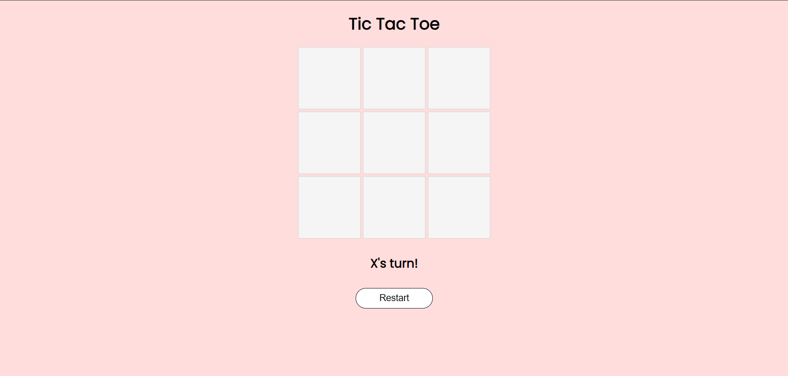
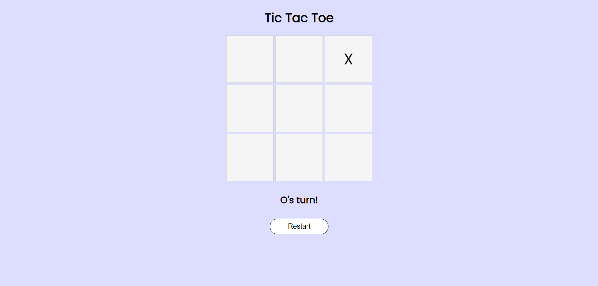
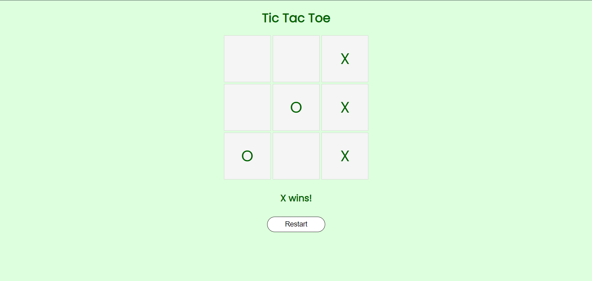
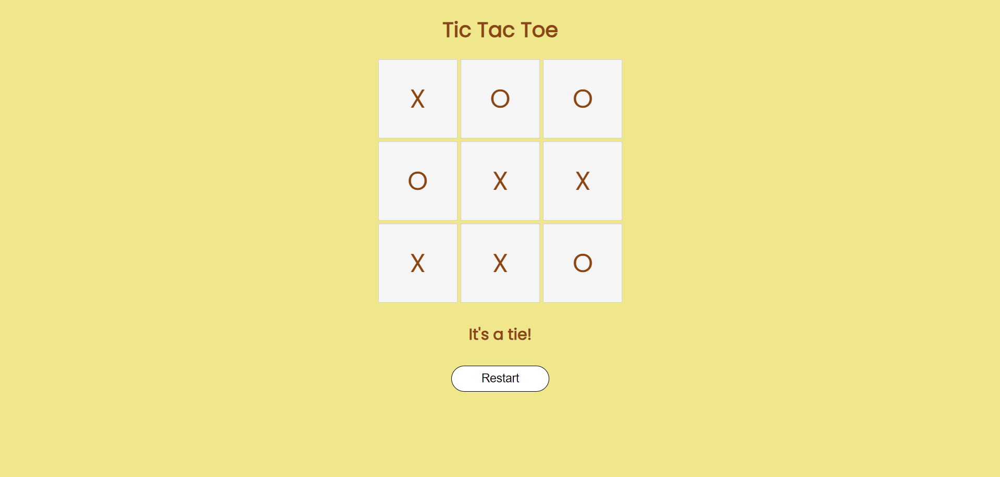

# Tic Tac Toe Game

## Overview

This project is a simple implementation of the classic Tic Tac Toe game using HTML, CSS, and JavaScript. The game supports two players who alternate turns to place their respective symbols (X and O) on a 3x3 grid. The objective is to get three of your symbols in a row, column, or diagonal to win the game. If the board is filled and no player has won, the game is declared a tie.

## Features

- **Two-Player Gameplay**: Players take turns to place their symbols on the board.
- **Turn Indication**: The background color changes based on the current player's turn (X or O).
- **Win Detection**: The game detects when a player has won and displays a message.
- **Tie Detection**: The game detects when the board is full and no player has won, displaying a tie message.
- **Restart Button**: A button to restart the game and clear the board.
- **Enhanced UI**: Visual feedback with background color changes and messages to enhance the user experience.

## Game Instructions

1. Players take turns clicking on the cells of the 3x3 grid to place their symbols (X or O).
2. The game alternates between players each turn, indicated by the background color.
3. The first player to get three of their symbols in a row, column, or diagonal wins.
4. If all cells are filled and no player has won, the game is declared a tie.
5. Click the "Restart" button to clear the board and start a new game.

## Screenshots

### Initial Screen

<!-- ### X's Turn
 -->

### O's Turn

### X Wins

### Tie

## Setup

1. Clone the repository or download the ZIP file.
2. Open `index.html` in your web browser to start the game.

## File Structure

- `index.html`: The main HTML file containing the structure of the game.
- `styles.css`: The CSS file for styling the game board and elements.
- `app.js`: The JavaScript file implementing the game logic and interactivity.

## License

This project is open-source and available under the [MIT License](LICENSE).

## Author

Sai Surya Talla

---